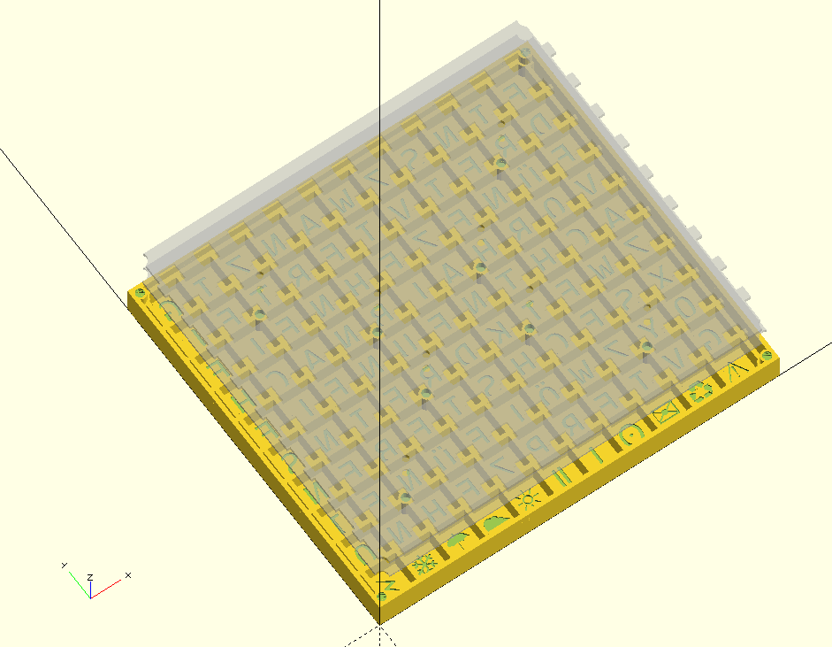

textclock
=========

textclock is a parametric 3d-printable textclock. It's currently in development.

It's designed to be used with a 60 led/m SK6812 led-strip, and an esp8266 (using micropython) 
for control. Using an ESP32 is also possible, but timer handling and pins
might need to be changed.

The letterface is available in English and German, but can be easily adapted to other languages.

The process of installing the software is described in the [software-folders README](software/README.md)
